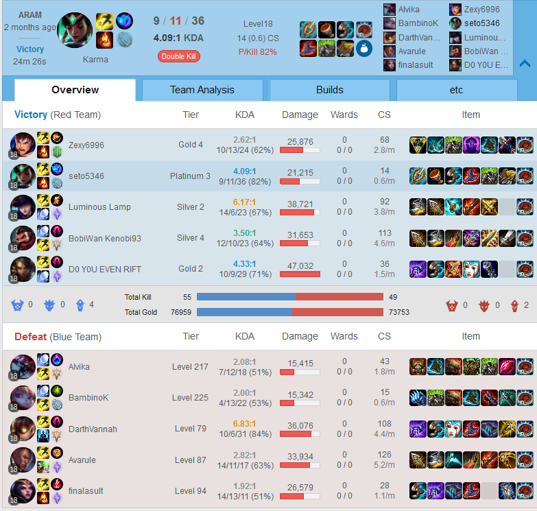

# League Info Bot

Bot is made for discord to see their league stats from OP.GG website using Puppeteer and Discord Js.

 

## What is Puppeteer?

"Puppeteer is a Node library which provides a high-level API to control headless Chrome or Chromium over the DevTools Protocol. It can also be configured to use full (non-headless) Chrome or Chromium." I.e, a high-level webscraping library in JavaScript. 

## Commands

### -stats [username]

Command uses Puppeteer to webscrape ranked info from OP.GG's DOMs for the specific username. It then outputs information in an Embed to the user using Discord's API.

### -lastgame [username]

Command uses Puppeteer to webscrap info by interacting with the page and getting the most recent match of the player profile

### -patchnotes [champion]

Command uses Puppeteer to webscrape from leagues official pathnotes, it will look at the latest patchnotes and it will send back a pic of the changes

## FUTURE UPDATES
- For patch notes, bot will locally store the images of the latest patch so that command responses are faster (each img path associated with an object w/ patch + champ)
